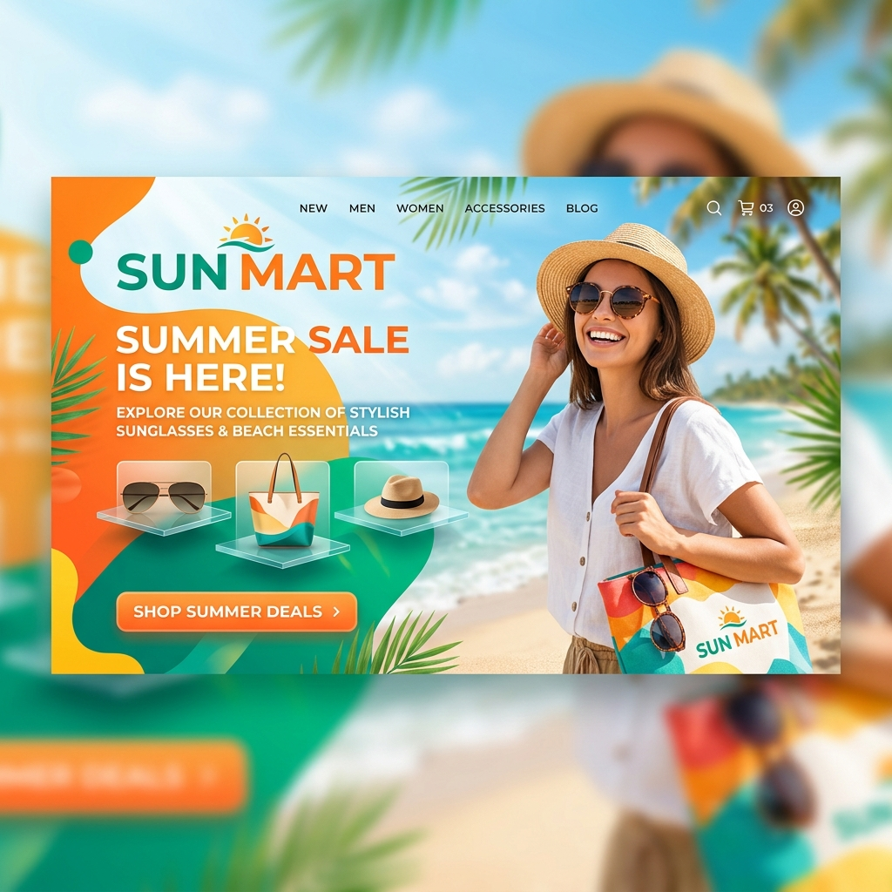

# <p align="center">☀️ Sun Mart - Premium Summer eCommerce</p>

<p align="center">
  
</p>

<p align="center">
  
  
  
  
</p>

---

## 🌟 Overview

**Sun Mart** is a modern, vibrant summer-themed eCommerce platform designed for a premium shopping experience. Whether you're looking for the perfect pair of sunglasses, trendy beachwear, or essential skincare, Sun Mart brings the heat with a sleek UI and smooth interactions.

Built with the latest **Next.js 16 App Router**, **Tailwind CSS v4**, and **DaisyUI**, this project showcases high-performance rendering and state-of-the-art web design.

---

## ✨ Key Features

- 🚀 **Next.js 16 Power**: Utilizing the latest App Router for lightning-fast navigation and SEO optimization.
- 🎨 **Premium Aesthetic**: A curated "Summer Vibe" design with vibrant colors, soft shadows, and modern typography.
- ✨ **Dynamic Animations**: Smooth scroll-reveals and hover effects powered by `animate.css`.
- 🔐 **Mock Auth System**: Fully implemented UI for Login/Register flows with protected route logic.
- 📱 **Mobile First**: Pixel-perfect responsiveness across all devices.
- 👤 **Profile Dashboard**: Personalized user profiles with mock settings management.
- 📦 **Dynamic Product Grid**: Real-time rendering of products from structured JSON data.

---

## 🛠️ Tech Stack

- **Framework**: [Next.js 16](https://nextjs.org/)
- **Styling**: [Tailwind CSS v4](https://tailwindcss.com/) & [DaisyUI](https://daisyui.com/)
- **Icons**: [Lucide React](https://lucide.dev/)
- **Animations**: [Animate.css](https://animate.style/)
- **Auth Concept**: [Better-Auth](https://better-auth.com/) (Mocked)

---

## 🚀 Getting Started

Follow these steps to get the project running locally:

### 1. Clone the repository
```bash
git clone https://github.com/tayabunn/sun-mart.git
cd sun-mart
```

### 2. Install dependencies
```bash
npm install
```

### 3. Setup environment variables
Create a `.env.local` file in the root directory:
```env
BETTER_AUTH_SECRET=your_secret_key
BETTER_AUTH_URL=http://localhost:3000
```

### 4. Run the development server
```bash
npm run dev
```

Visit [http://localhost:3000](http://localhost:3000) to see the magic! ✨

---

## 📸 Preview

*(Add your screenshots here after deployment)*

---

## 🗺️ Roadmap

- [ ] Real-time Payment Integration (Stripe/SSLCommerz)
- [ ] User Review & Rating System
- [ ] Dark/Light Mode Toggle
- [ ] Multi-language Support (i18n)

---

<p align="center">Made with ❤️ by <a href="https://github.com/tayabunn">Tayabunn</a></p>

---
*Happy Coding!* ✨